 
## 查看主页获取源码

> **作者介绍**： **✌**全网粉丝10W+本平台特邀作者、博客专家、CSDN新星计划导师、java领域优质创作者,博客之星、掘金/华为云/阿里云/InfoQ等平台优质作者、专注于项目实战 **✌**

  

### 一、作品包含

源码+数据库+设计文档万字+PPT+全套环境和工具资源+部署教程

### 二、项目技术

前端技术：Html、Css、Js、Vue、Element-ui

数据库：MySQL

后端技术：Java、Spring Boot、MyBatis

  

### 三、运行环境

开发工具：IDEA/eclipse

数据库：MySQL5.7

数据库管理工具：Navicat10以上版本

环境配置软件： JDK1.8+Maven3.6.3

前端Nodejs：14

### 四、项目介绍
项目编号：springbootA079

随着科学技术发展，计算机已成为人们生活中必不可少的生活办公工具，在这样的背景下，网络技术被应用到各个方面，为了提高办公生活效率，网络信息技术飞速发展。在这样的背景下人类社会进入了全新的信息化的时代。为了使大学生心理健康诊断专家的管理更符合用户的需求，同时也能方便管理者管理和提高工作效率，所以本人设计了大学生心理健康诊断专家系统，该系统包括了学生、专家、音乐库、专家预约、专家咨询、心理测试等。学生通过注册登录到网站查看专家信息进行专家预约、咨询等相关信息，专家对预约信息进行审核、回复等，管理员对所有信息进行增删改查，不用手动抄录大量的数据报表，达到了双赢。

### 五、运行截图

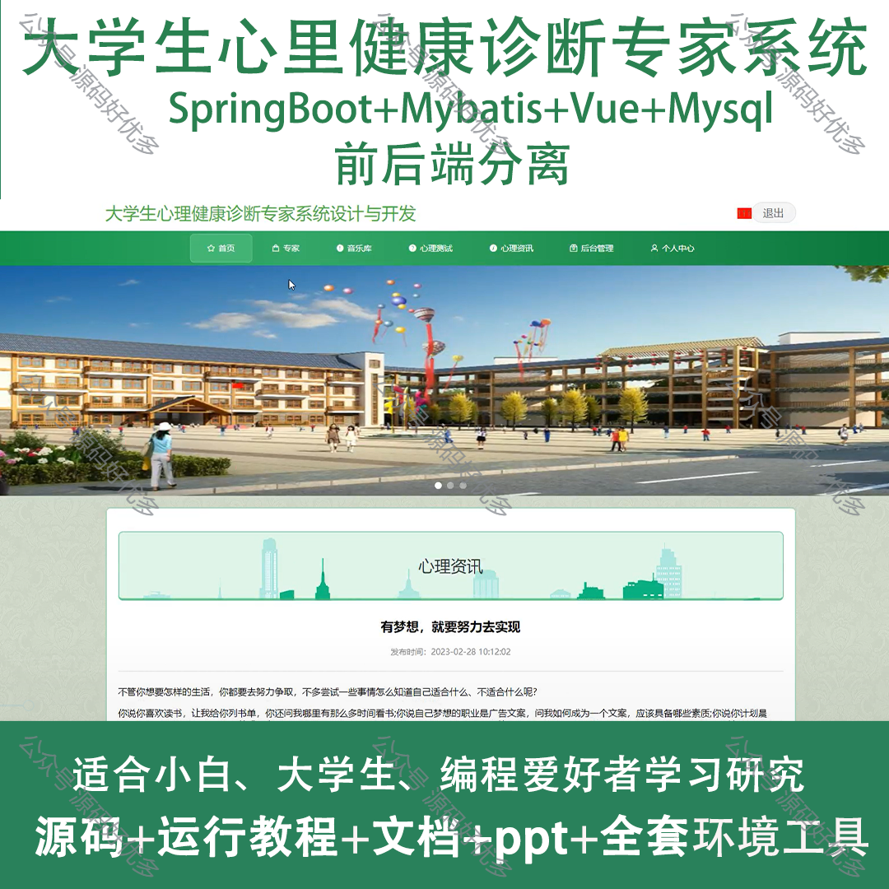
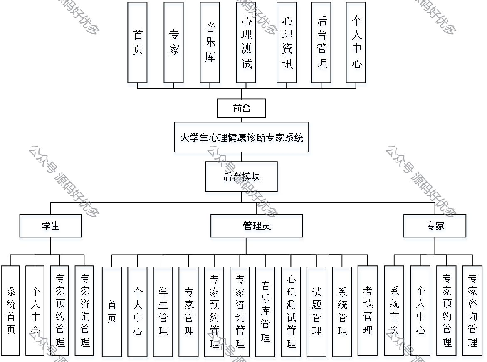
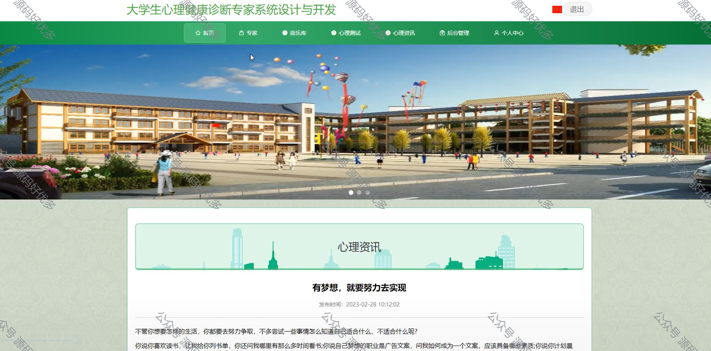
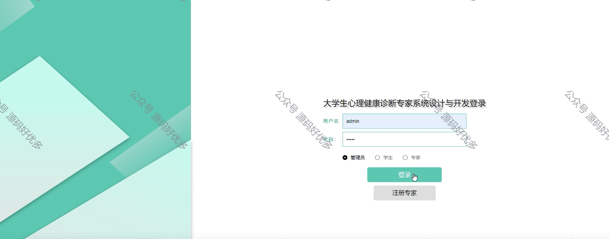
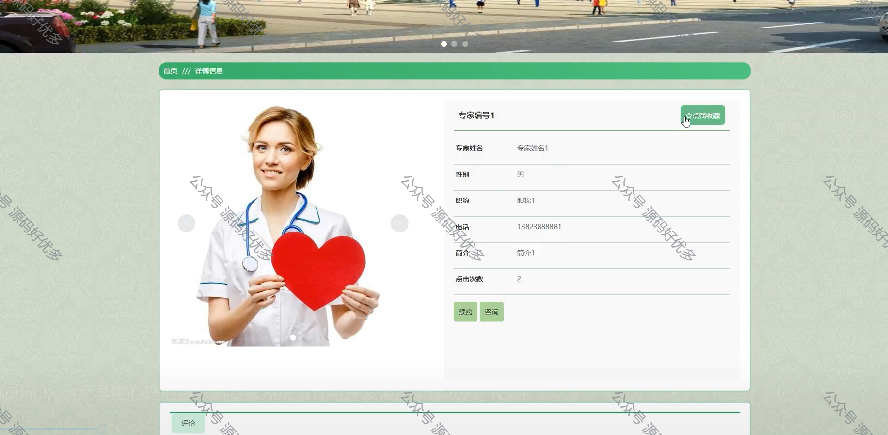
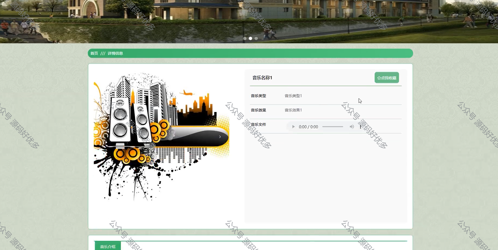
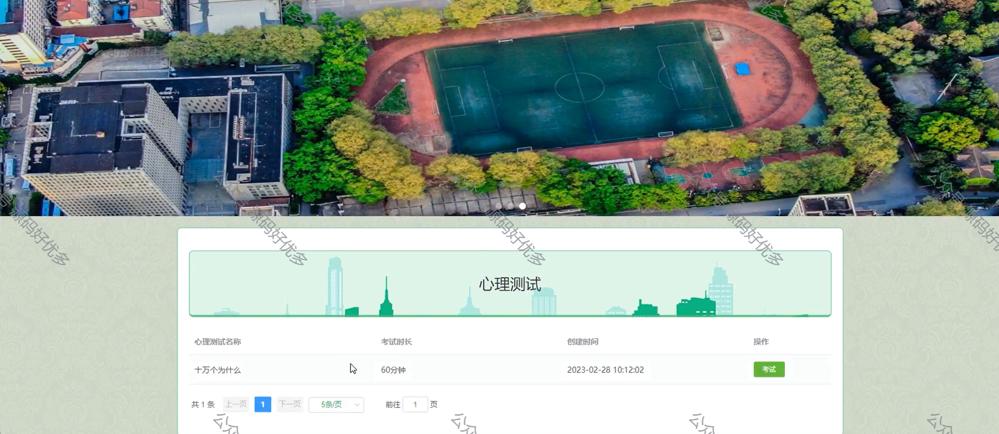
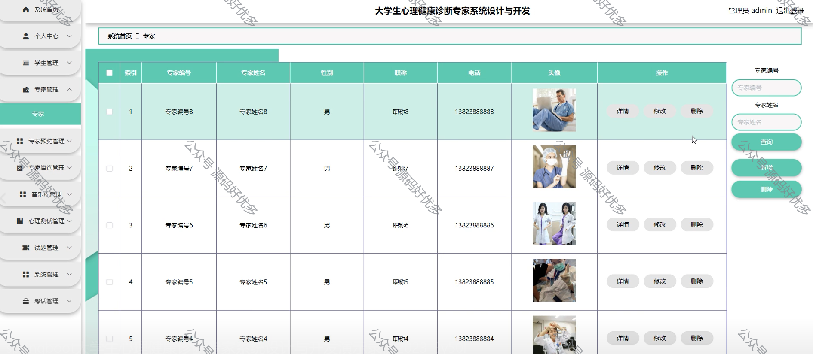
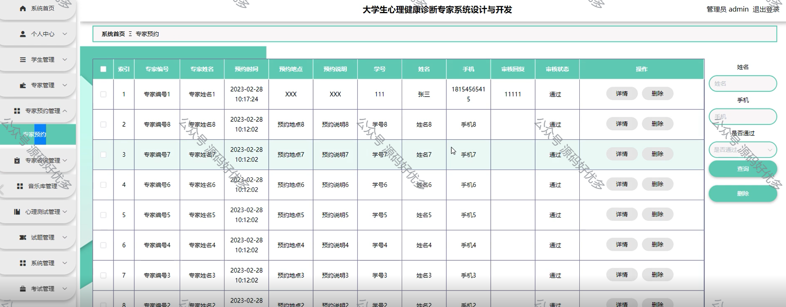
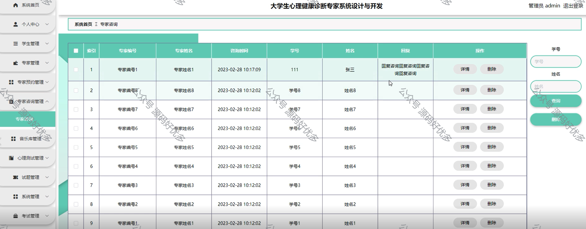
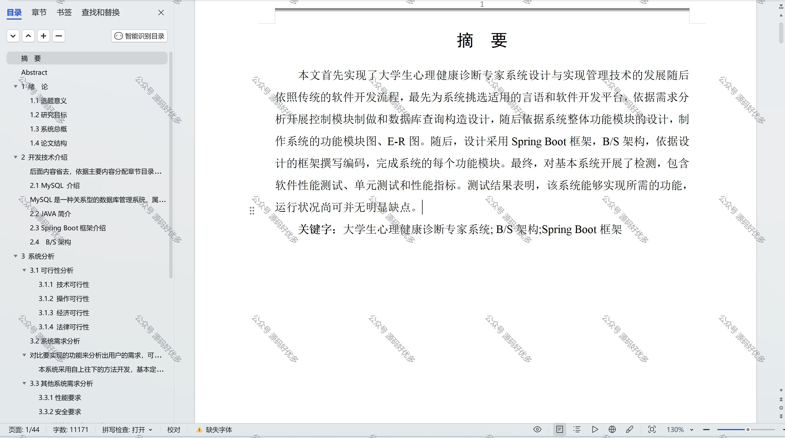

  
